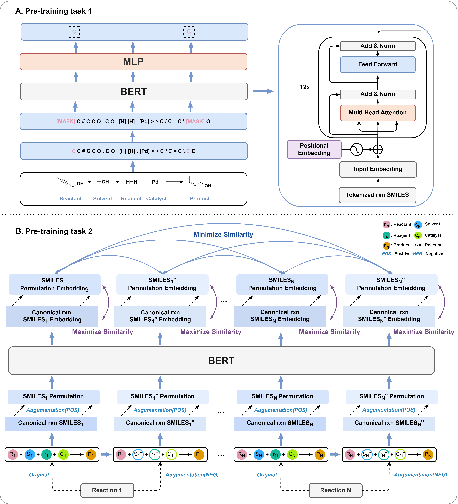

# Egret - 2 
Enhancing Generic Reaction Yield Prediction by Adding Temperature to existing Egret Model



## Contents
- [OS Requirements](#os-requirements)
- [Python Dependencies](#python-dependencies)
- [Installation Guide](#installation-guide)
- [Use Egret](#use-egret)

## OS Requirements
This repository has been tested on **Linux**  operating systems.

## Python Dependencies
* Python (version >= 3.7) 
* PyTorch (version >= 1.13.0) 
* RDKit (version >= 2020)
* Transformers (version == 4.18.0)
* Simpletransformers (version == 0.61.13)
* rxnfp (Use custom rxnfp)

## Installation Guide
Create a virtual environment to run the code of Egret.<br>
Make sure to install pytorch with the cuda version that fits your device.<br>
This process usually takes few munites to complete.<br>
```
git clone https://github.com/Pranav2907/Dissertation-Egret-2.git
cd Egret
conda env create -f envs.yaml
conda activate egret_env
```
```
cd inference
python yield_predict.py --input_path path/to/input_file.txt \
                        --output_path path/to/output.csv \
```
For example, by using the following command, you can obtain the predicted yield values or intervals for chemical reactions in the "input_demo.txt" file.<br>
```
cd inference
python yield_predict.py --input_path test_files/input_demo.txt \
                        --output_path test_files/predicted_yields.csv \
```
